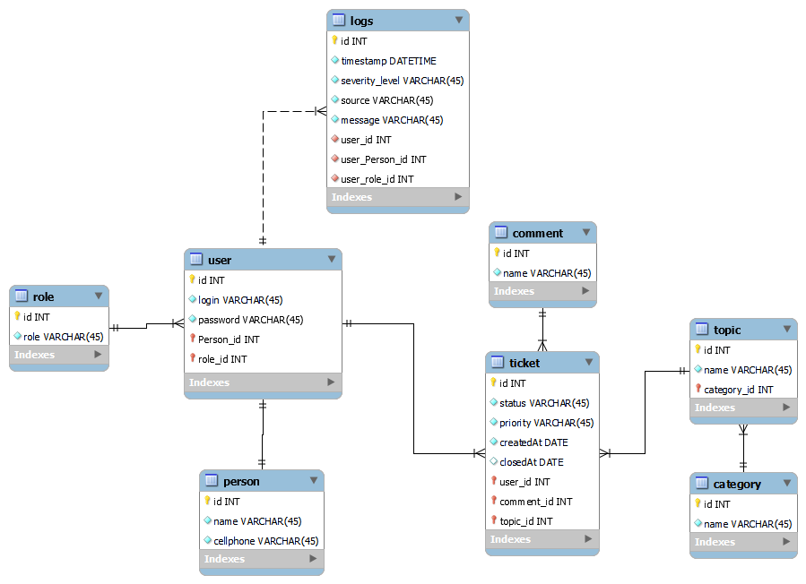
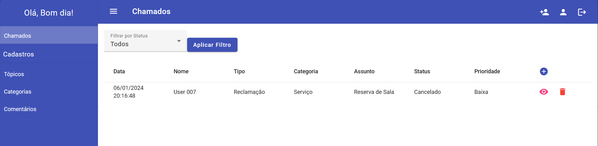
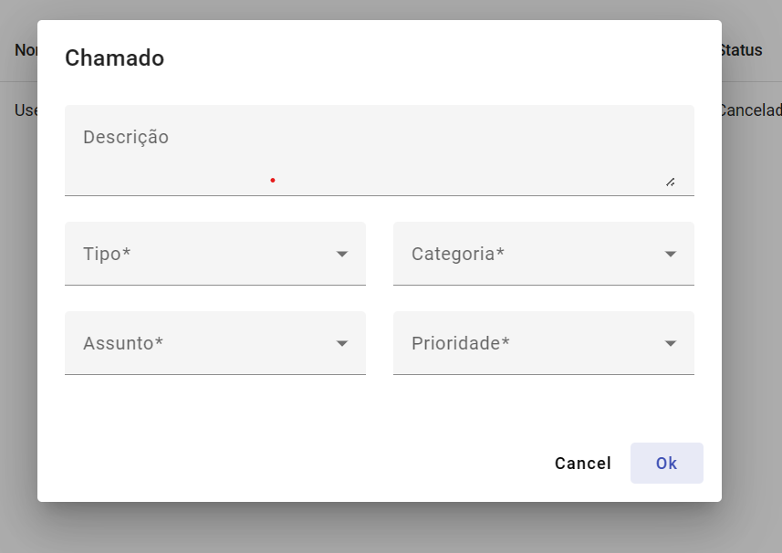
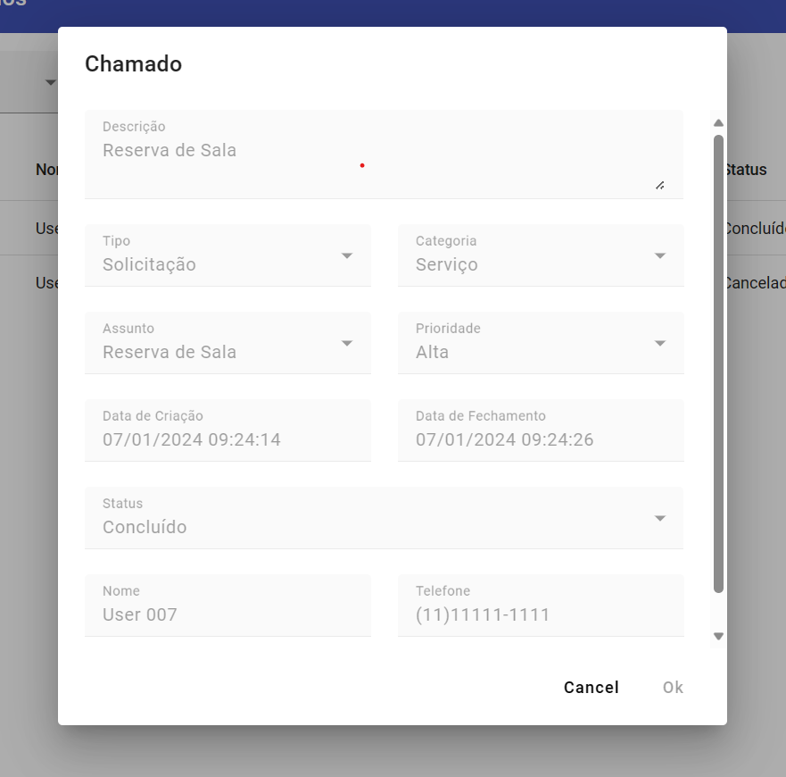

# Rápido Chamados

Sistrma para gerenciamento e acompanhamento de solicitação de chamados

## Tecnologias Utilizadas
### Backend

### Frontend

## Pré-requisitos

- Java 17
- Maven
- Angular 16
- Node.js e npm compátiveis com a versão do Angular 

## Funcionalidades Principais
### Admin
    - CRUD de chamados
    - CRUD de assunto, categoria e comentário
    - CRUD de usuário
### Usuário
    - Cadastro e visualização dos chamados

## Estrutura do Banco de dados

## Front End

*Página inicial.*

*Cadastro de Chamados*

*Acompanhamento de Chamados*

## Contribuidores 
- Professores: Luan Vieira e Gabriel Flores - UFN
- Colegas: Osvaldo Ribeiro e Luzielma - UFN
  
## Contato
- [LinkedIn](https://www.linkedin.com/in/lucas-bt/)

